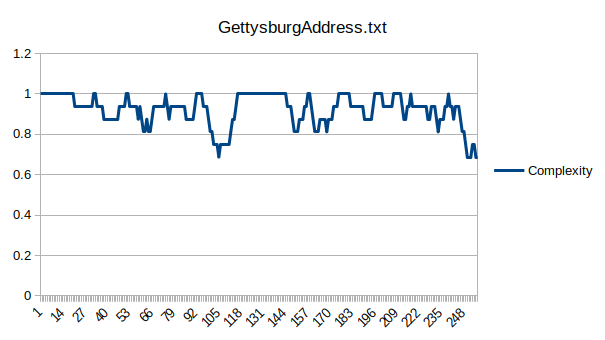
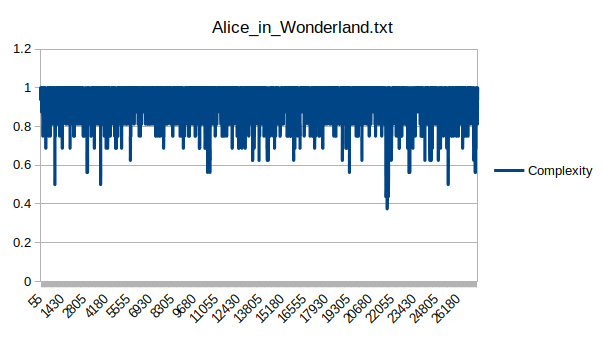
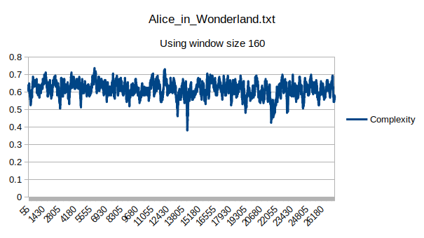

# Convolution

Examine text complexity.

## Run

```
./bin/convolution [filename]
```

## Output


```
parsed 271 words from /home/dan/CLionProjects/convolution/GettysburgAddress.txt
complexity summary:
	average: 0.9219	min: 0.6875	max: 1.0000
wrote 256 records to /home/dan/CLionProjects/convolution/GettysburgAddress.txt.csv
```

```
parsed 27340 words from /home/dan/CLionProjects/convolution/Alice_in_Wonderland.txt
complexity summary:
	average: 0.9234	min: 0.3750	max: 1.0000
wrote 27325 records to /home/dan/CLionProjects/convolution/Alice_in_Wonderland.txt.csv
```

## Analysis





```
parsed 27340 words from /home/dan/CLionProjects/convolution/Alice_in_Wonderland.txt
complexity summary:
	average: 0.6161	min: 0.3812	max: 0.7375
wrote 27181 records to /home/dan/CLionProjects/convolution/Alice_in_Wonderland.txt.csv
```



